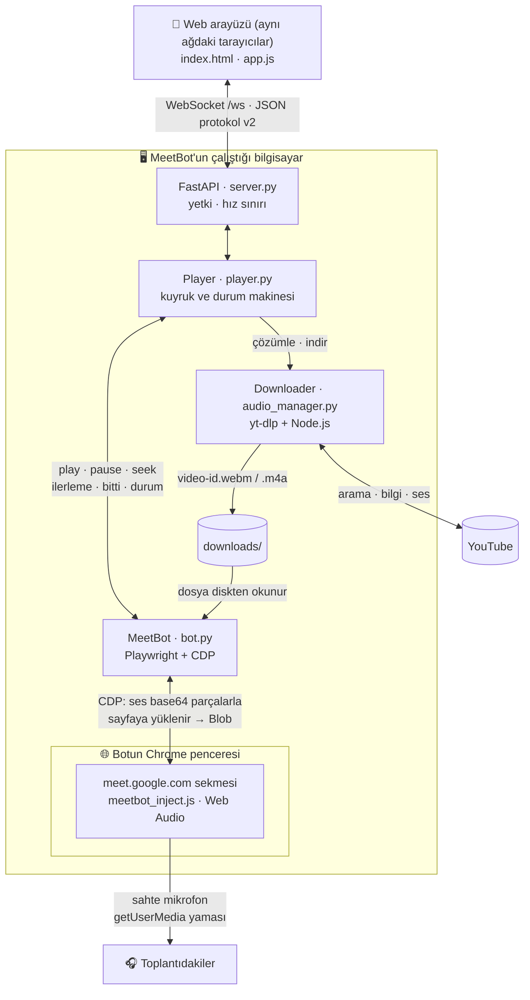

<div align="center">

# 🎵 MeetBot 3.2
**Google Meet Müzik ve Ses Botu**

[](https://www.python.org/downloads/)
[](https://fastapi.tiangolo.com/)
[](https://playwright.dev/)
[](https://tailwindcss.com/)
[](LICENSE)

*Google Meet toplantılarına katılıp doğrudan tarayıcı içinden, mikrofonu meşgul etmeden, yüksek kaliteli stüdyo sesiyle müzik paylaşımı yapan modern, asenkron ve otonom bir bot.*

---

</div>

## ✨ 3.2'de Neler Yeni?

- 🔐 **Gerçek yönetici girişi:** Şifre artık sunucuda doğrulanıyor (koda gömülü `password123` tarihe karıştı). Misafirlerin neler yapabileceğini tek bir ayar belirliyor.
- 🔊 **Chrome 153 uyumu:** Chrome'un *Local Network Access* koruması yüzünden susan bot yeniden çalıyor. Ses artık sayfaya doğrudan yükleniyor.
- 🚪 **Anonim katılım gerçekten çalışıyor:** Bot adını yazıyor ve kabul, ret ya da zaman aşımını ayırt ediyor. Katılım panelden iptal edilebiliyor.
- 🔎 **Yeni özellikler:** Şarkı adıyla arama, oynatma listeleri, tekrar modları, ileri/geri sarma, "son çalınanlar" ve dinleyen listesi.
- 🧰 **Daha kolay kurulum:** ffmpeg artık gerekmiyor. `.env` ile ayar yapılıyor; `start.bat`, `--doctor` ve `--fake-bot` eklendi.
- 🛡️ **Güvenlik ve testler:** XSS, yt-dlp argüman enjeksiyonu, SSRF ve bilgisayardaki bütün Chrome'ları kapatan `taskkill` gibi sorunlar giderildi. Artık 500'ü aşkın otomatik test var.

Tüm liste için 👉 [CHANGELOG.md](CHANGELOG.md)

---

## 🚀 Öne Çıkan Özellikler

- 🎛️ **Modern Web Dashboard:** Neon Synthwave/Vaporwave estetiğinde kontrol paneli. Telefonda da rahat kullanılıyor ve WebSocket sayesinde her şey gerçek zamanlı güncelleniyor.
- 🔎 **Link, liste ya da şarkı adı:** YouTube / YouTube Music linki, oynatma listesi ya da sadece şarkının adı. Bot ilk arama sonucunu bulup kuyruğa ekler.
- 🎶 **Akıllı Kuyruk:** Sürükle-bırak, yukarı/aşağı taşıma, "şimdi çal", karıştır ve temizle. Sıradaki şarkılar arka planda önceden indirilir (prefetch), kuyruğun toplam süresi de görünür.
- ⏯️ **Oynatma:** Oynat, duraklat, durdur ve geç (skip). İlerleme çubuğundan ileri/geri sarılabilir. Tekrar modları: kapalı / şarkı / liste.
- 🔊 **Web Audio ile ses enjeksiyonu:** Sanal kablo gerekmez. Ses, botun tarayıcısındaki *48 kHz* Web Audio zincirinden Meet'e "mikrofon" olarak gider. İsteğe bağlı bir kompresör, şarkılar arasındaki ses farkını yumuşatır.
- 🎚️ **Bağımsız Ses Kontrolü:** *Müzik* sesi ile botun *mikrofon çıkış* sesi ayrı ayrı ayarlanır. Botun mikrofonu tek tıkla sessize alınır.
- 🤖 **Tam Otonom Katılım:** Meet linkini verin, gerisini bot halleder. Katılma ekranında adını yazar, kamerasını kapatır ve katılma isteği gönderir. İçeri alınınca müziği bozmasın diye Meet'in gürültü giderme özelliğini kapatır.
- 🩺 **Kendini izleyen bot:** Toplantıdan çıkarılırsa, toplantı biterse ya da sekme çökerse bunu fark eder. O an müzik duraklar; bot tekrar katılınca şarkı kaldığı yerden devam eder.
- 🔐 **Yönetici / Misafir yetkileri:** Şifre sunucuda doğrulanır. Misafirlerin kontrolleri tek bir ayarla açılıp kapanır.
- 👥 **Dinleyenler ve Geçmiş:** Paneli kimlerin açtığı görünür. Son çalınanlar tek tıkla yeniden eklenir.
- 🛡️ **Hata Toleransı:** Kopan bağlantı giderek uzayan aralıklarla yeniden denenir. İndirilemeyen şarkı atlanır ve yavaş bir istemci kimseyi bekletmez.

---

## 🛠️ Kullanılan Teknolojiler

### **Backend (Arka Plan)**
- **Python 3.10+ & FastAPI / Uvicorn:** Asenkron web sunucusu ve WebSocket (protokol v2, bkz. [docs/PROTOCOL.md](docs/PROTOCOL.md)).
- **Playwright (async) + Chrome DevTools Protocol:** Botun **bilgisayarınızdaki Chrome/Edge** ile açtığı pencereyi yönetir. Playwright'ın kendi tarayıcısını indirmeye gerek yoktur.
- **yt-dlp (+ yt-dlp-ejs ve Node.js):** YouTube araması, bilgi çekme ve dönüştürmeden ses indirme işlerini yapar.
- **Web Audio API:** Meet sekmesine enjekte edilen ses motoru (`meetbot_inject.js`).

### **Frontend (Arayüz)**
- **Tailwind CSS:** Derlenmiş `static/tailwind.css` kullanılır, CDN'e bağımlılık yoktur. Neon efektler ve animasyonlar da buradan gelir.
- **Vanilla JavaScript:** 0 bağımlılık; arayüz `app.js` üzerinden yönetilir. Tüm metinler `innerHTML` kullanılmadan, DOM API'leriyle yazılır.
- **Google Material Symbols:** Estetik ve ölçeklenebilir ikon ailesi.

---

## 📋 Gereksinimler

| Gereksinim | Neden? |
|---|---|
| **Python 3.10+** | Sunucu, bot ve yt-dlp bunu gerektiriyor. (3.1'de 3.9 yazıyordu, artık yetmiyor.) |
| **Google Chrome** veya **Microsoft Edge** | Bot toplantıya kendi Chrome/Edge penceresiyle katılır. Tarayıcı otomatik bulunur; başka bir yerde kuruluysa `MEETBOT_CHROME_PATH` ayarını kullanın. |
| **Node.js 22+** (önerilen: güncel LTS) | YouTube, ses dosyalarının adreslerini JavaScript tabanlı bir bulmacayla (*"n challenge"* / imza) korur. yt-dlp bu bulmacayı YouTube'un kendi JS kodunu çalıştırarak çözer. Bunun için bir **JS çalışma ortamı** (Node.js, Deno veya Bun) ve **yt-dlp-ejs** çözücüsü gerekir. `yt-dlp-ejs`, `requirements.txt`'teki `yt-dlp[default]` ile otomatik gelir; Node.js'i ise sizin kurmanız gerekir. Node yoksa bazı şarkılar hiç indirilemeyebilir ya da yavaş iner. |
| İnternet bağlantısı | YouTube ve Google Meet için. |
| ~~ffmpeg~~ | **Artık gerekmiyor.** Ses, YouTube'un kendi biçiminde (opus/webm veya m4a) indirilir ve dönüştürülmez; Chrome bu biçimleri doğrudan çalar. |

---

## ⚡ Hızlı Başlangıç (Windows)

1. **Python 3.10+** ([python.org](https://www.python.org/downloads/), kurulumda *"Add python.exe to PATH"* seçeneğini işaretleyin), **Google Chrome** ve **Node.js LTS** ([nodejs.org](https://nodejs.org/)) kurun.
2. Projeyi indirin (`git clone` ya da ZIP) ve klasörü açın.
3. **[`start.bat`](start.bat)'a çift tıklayın.** Betik şunları yapar:
   - İlk çalıştırmada `.venv` sanal ortamını oluşturur ve `requirements.txt`'i yükler (birkaç dakika sürebilir). `requirements.txt` sonradan değişirse (ör. projeyi güncellediğinizde) bağımlılıkları bir sonraki açılışta kendiliğinden günceller.
   - `.env` dosyası yoksa [`.env.example`](.env.example)'dan kopyalar.
   - Ardından `main.py`'yi başlatır. Verdiğiniz argümanları ona aktarır: `start.bat --doctor`, `start.bat --fake-bot`, `start.bat --port 8080`.
4. Konsolda yazan adresi açın (varsayılan **http://localhost:8000**). Yönetici şifresi de konsolda yazar (aşağıdaki **İlk Çalıştırma** bölümüne bakın).

> ℹ️ YouTube bir şeyleri değiştirip indirmeler bozulursa yt-dlp'yi elle güncelleyebilirsiniz:
> ```bat
> .venv\Scripts\python -m pip install -U "yt-dlp[default]"
> ```

---

## 🧩 Elle Kurulum (Windows / macOS / Linux)

Proje klasöründe bir terminal açın:

```bash
python -m venv .venv          # macOS / Linux: python3 -m venv .venv

# Windows
.venv\Scripts\activate
# macOS / Linux
source .venv/bin/activate

python -m pip install -r requirements.txt
python main.py --doctor      # kurulumu denetle (Chrome, yt-dlp, Node.js, port...)
python main.py               # başlat
```

Komut satırı seçenekleri:

| Seçenek | Açıklama |
|---|---|
| `--host ADRES` | Dinlenecek adres (`MEETBOT_HOST`'u ezer). |
| `--port PORT` | Port (`MEETBOT_PORT`'u ezer). |
| `--fake-bot` | Chrome ve Meet olmadan sahte botla çalışır (bkz. [Demo modu](#-demo-modu-ve-kurulum-denetimi)). |
| `--doctor` | Kurulumu denetler, ✅/❌ tablosu yazar ve çıkar. Her şey yolundaysa çıkış kodu 0, değilse 1'dir. |

> 💡 `playwright install chromium` **artık gerekmiyor**, çünkü bot bilgisayarınızdaki Chrome/Edge'i kullanıyor. Playwright'ın kendi Chromium'u yalnızca **testleri** çalıştırmak için lazım (bkz. [Geliştirme](#-geliştirme)).
>
> 🐧 **Linux:** Bot Chrome'u normal (görünür) bir pencere olarak açar. Bu yüzden bir masaüstü oturumu ya da Xvfb gibi sanal bir ekran gerekir. Root olarak çalışırken `--no-sandbox` otomatik eklenir.

---

## 🐧 Linux Sunucuya Kurulum (SSH, ekransız)

MeetBot ekranı olmayan bir Linux sunucuda (VPS) da çalışır. Bot, Chrome'u kendi açtığı **sanal ekranda (Xvfb)** çalıştırır; Google girişi için paneldeki **Bot ekranı** kullanılır (bkz. [9️⃣](#9️⃣-bot-ekranı-ve-google-girişi-yönetici)). Aşağıdaki adımlar Ubuntu/Debian içindir (Ubuntu 25.10'da denendi).

**1. Sistem paketleri, Google Chrome ve Node.js**
```bash
sudo apt update
sudo apt install -y python3-venv xvfb fonts-liberation fonts-noto-core fonts-noto-color-emoji wget
wget https://dl.google.com/linux/direct/google-chrome-stable_current_amd64.deb
sudo apt install -y ./google-chrome-stable_current_amd64.deb
# Node.js 22+ (dağıtımın paketi eskiyse nodejs.org'dan LTS kurun):
node --version
```

**2. Ayrı bir kullanıcı ve kurulum** (Chrome'u root olarak çalıştırmayın)
```bash
sudo useradd --system --create-home --home-dir /opt/meetbot --shell /usr/sbin/nologin meetbot
sudo git clone https://github.com/Quenchh/MeetBot3.1 /tmp/meetbot && sudo cp -r /tmp/meetbot/. /opt/meetbot/
sudo chown -R meetbot:meetbot /opt/meetbot
cd /opt/meetbot
sudo -u meetbot python3 -m venv .venv
sudo -u meetbot .venv/bin/pip install -r requirements.txt
sudo -u meetbot cp .env.example .env    # MEETBOT_ADMIN_PASSWORD'ü mutlaka doldurun
sudo -u meetbot .venv/bin/python main.py --doctor
```
`--doctor` çıktısında *Sanal ekran (Xvfb)* satırı da ✅ olmalı.

**3. Servis olarak çalıştırın** (açılışta başlar, çökerse yeniden başlar)
```bash
sudo cp deploy/meetbot.service /etc/systemd/system/
sudo systemctl daemon-reload
sudo systemctl enable --now meetbot
journalctl -u meetbot -f          # günlük
```
Elle denemek için: `sudo -u meetbot ./start.sh` (`start.bat`'ın Linux karşılığı).

**4. Panele erişim**
- Arkadaşlarınız `http://SUNUCU_IP:8000` adresinden şarkı ekler. Güvenlik duvarı varsa 8000 portunu açın (`sudo ufw allow 8000/tcp`).
- **Yönetici işleri için SSH tüneli kullanın.** Kendi bilgisayarınızda:
  ```bash
  ssh -L 8000:127.0.0.1:8000 kullanici@SUNUCU_IP
  ```
  Ardından **http://localhost:8000** adresini açın. Tünel şifrelidir; üstelik **Bot ekranı** güvenlik gereği yalnızca bu yoldan (ya da sunucunun kendisinden) açılabilir (`MEETBOT_REMOTE_VIEW=local`).

---

## ⚙️ Yapılandırma

Ayarlar proje klasöründeki **`.env`** dosyasından ([`.env.example`](.env.example)'ı `.env` adıyla kopyalayın) ya da ortam değişkenlerinden okunur. Öncelik sırası: **ortam değişkeni > `.env` > varsayılan**. `--host` ve `--port` ikisini de ezer.

| Anahtar | Varsayılan | Açıklama |
|---|---|---|
| `MEETBOT_HOST` | `0.0.0.0` | Dinlenecek adres. `0.0.0.0` ile aynı ağdaki herkes panele erişebilir. Sadece bu bilgisayar için `127.0.0.1` yazın. |
| `MEETBOT_TRUSTED_HOSTNAMES` | *(boş)* | Panele IP, `localhost`, bilgisayar adı ya da `.local`/`.lan` gibi yerel adlar dışında bir **alan adıyla** (ör. ters vekil üzerinden `meetbot.example.com`) erişiyorsanız o adlar, virgülle ayrılmış. `*` bu denetimi kapatır. Tanınmayan adlarla gelen istekler DNS-rebinding saldırılarına karşı reddedilir. |
| `MEETBOT_PORT` | `8000` | Web arayüzünün portu (1–65535). |
| `MEETBOT_LOG_LEVEL` | `INFO` | Günlük düzeyi: `DEBUG`, `INFO`, `WARNING`, `ERROR`, `CRITICAL`. |
| `MEETBOT_ADMIN_PASSWORD` | *(boş)* | Yönetici şifresi. **Boşsa her açılışta rastgele bir şifre üretilir** ve konsola yazılır. |
| `MEETBOT_GUEST_CONTROLS` | `true` | `true` ise misafirler de duraklat, geç, sırala, sar ve ses gibi oynatma kontrollerini kullanabilir, herkesin şarkısını kaldırabilir. `false` ise yalnızca şarkı ekleyip **kendi** eklediklerini kaldırabilirler (bkz. [Yetki Modeli](#-yetki-modeli)). |
| `MEETBOT_REMOTE_VIEW` | `local` | Yöneticinin panelden botun tarayıcısını görüp kullanması (**Bot ekranı**, ör. Google girişi): `local` → yalnızca bu bilgisayardan ya da SSH tüneliyle, `on` → her yerden (düz HTTP'de yazılan şifreler şifrelenmeden gider!), `off` → kapalı. |
| `MEETBOT_MAX_QUEUE` | `100` | Kuyrukta bulunabilecek en fazla şarkı sayısı. |
| `MEETBOT_MAX_USER_QUEUE` | `0` | Bir kişinin kuyrukta bekleyen en fazla şarkı sayısı (`0` = sınırsız). |
| `MEETBOT_MAX_DURATION` | `0` | Saniye cinsinden en uzun şarkı (`0` = sınırsız, varsayılan). Sınır verilirse daha uzun şarkılar eklenmez; listelerde atlanır. |
| `MEETBOT_PLAYLIST_LIMIT` | `25` | Bir oynatma listesinden eklenecek en fazla şarkı (1–200). |
| `MEETBOT_PREFETCH` | `2` | Önceden indirilecek sıradaki şarkı sayısı (0–10). |
| `MEETBOT_HISTORY_SIZE` | `20` | "Son çalınanlar" listesinin uzunluğu (0–200). |
| `MEETBOT_ALLOWED_HOSTS` | `youtube.com,youtu.be,music.youtube.com` | Kabul edilen link alan adları; alt alan adları da geçerlidir (`www.`, `m.`). Diğer linkler yt-dlp'ye hiç gönderilmeden reddedilir. MeetBot yalnızca YouTube'u destekler. |
| `MEETBOT_YTDLP_JS_RUNTIME` | `auto` | YouTube JS doğrulamasında kullanılacak çalışma ortamı: `auto` (PATH'te Node.js varsa onu kullanır), `node`, `deno`, `bun` ya da `none`. |
| `MEETBOT_METADATA_TIMEOUT` | `45` | yt-dlp'nin şarkı bilgisi çekme zaman aşımı (sn, en az 5). |
| `MEETBOT_DOWNLOAD_TIMEOUT` | `900` | Tek bir şarkının indirme zaman aşımı (sn, en az 10). Çok uzun videolar (saatlik mix'ler) için gerekirse artırın. |
| `MEETBOT_BOT_NAME` | `MeetBot` | Bot **anonim** katılırken (profilde Google hesabı açık değilken) toplantıda görünecek ad. En fazla 60 karakter. |
| `MEETBOT_CHROME_PATH` | *(boş)* | `chrome.exe` / `msedge.exe` yolu. Boşsa tarayıcı otomatik bulunur (önce Chrome, sonra Edge). Girilen yol geçersizse bot otomatik aramaya dönmez, hata verir. |
| `MEETBOT_CDP_PORT` | `9222` | Botun Chrome'u yönettiği DevTools (CDP) portu. Bu portta zaten bir tarayıcı açıksa bot uyarı verip ona bağlanır (bkz. **Sorun Giderme**). |
| `MEETBOT_PROFILE_DIR` | `chrome_profil` | Botun Chrome profil klasörü. Göreli yollar proje klasörüne göre çözülür. |
| `MEETBOT_DOWNLOADS_DIR` | `downloads` | İndirme klasörü. Her açılışta yalnızca MeetBot'un kendi indirmeleri (`<video_kimliği>.<uzantı>` ve yt-dlp'nin yarım `.part/.ytdl/.temp` dosyaları) silinir; diğer dosyalara ve alt klasörlere dokunulmaz. Yine de ayrı bir klasör kullanın. |
| `MEETBOT_JOIN_TIMEOUT` | `180` | Katılma isteği gönderildikten sonra kabul edilmek için beklenecek süre (sn, en az 10). |
| `MEETBOT_NORMALIZE` | `true` | Şarkılar arasındaki ses seviyesi farkını yumuşatan kompresör (Web Audio `DynamicsCompressor`). |

- **Evet/hayır değerleri:** `true`/`false`, `1`/`0`, `yes`/`no`, `on`/`off`, `evet`/`hayır`. Değeri **boş** bırakılan anahtarlar varsayılan değerini kullanır.
- **Sayılar:** Aralık dışındaki sayılar en yakın sınıra çekilir. Geçersiz değerlerde varsayılan kullanılır ve konsola bir uyarı yazılır.

---

## 🔑 İlk Çalıştırma

Başlangıçta konsolda buna benzer bir karşılama yazısı çıkar:

```text
════════════════════════════════════════════════════════════
  🎵  MeetBot 3.2.0 — Google Meet Müzik Botu
════════════════════════════════════════════════════════════
  🌐  Bu bilgisayar : http://localhost:8000
  📶  Aynı ağdakiler: http://192.168.1.42:8000
  🔐  Yönetici şifresi: <her açılışta rastgele üretilir>
      (kalıcı yapmak için .env dosyasına MEETBOT_ADMIN_PASSWORD=... yazın)
  📋  Meet bağlantısını web arayüzünden (yönetici olarak) girin.
════════════════════════════════════════════════════════════
```

- 🔐 `MEETBOT_ADMIN_PASSWORD` boşsa **her açılışta yeni bir rastgele şifre** üretilir ve yukarıdaki gibi yazılır. Şifre `.env`'de ayarlıysa bu satır hiç çıkmaz.
- 📶 "Aynı ağdakiler" satırı yalnızca `MEETBOT_HOST=0.0.0.0` iken görünür; arkadaşlarınız bu adresi açar. Windows Güvenlik Duvarı Python için izin isterse yalnızca **Özel ağlar**'a izin verin.
- 🧹 `downloads/` klasöründeki eski MeetBot indirmeleri her açılışta silinir (başka dosyalara dokunulmaz).
- 🛑 Kapatmak için **Ctrl+C** (ya da Ctrl+Break) yeterli. Bot toplantıdan çıkar ve **yalnızca kendi açtığı** Chrome'u kapatır.

---

## 🎮 Kullanım Rehberi

### 1️⃣ Adınızı yazın
İlk açılışta *"ENTER THE GRID"* ekranı bir kullanıcı adı ister (1–32 karakter). Ad tarayıcınızda saklanır (`localStorage` → `meetbot_username`). Sağ üstteki ad rozetine tıklayarak değiştirebilirsiniz. Eklediğiniz şarkılarda ve *Dinleyenler* listesinde bu ad görünür.

### 2️⃣ Yönetici girişi (🔒 Admin)
Sağ üstteki kilitli **Admin** düğmesine basın ve konsolda yazan (ya da `.env`'deki) şifreyi girin.
- Şifre **sunucuda** doğrulanır. Tarayıcı yalnızca bir oturum anahtarı saklar (`meetbot_admin_token`); sayfayı yenilediğinizde ya da bağlantı koptuğunda bu anahtarla otomatik olarak yeniden giriş yapar.
- Anahtar, sunucu yeniden başlayana ya da siz çıkış yapana kadar geçerlidir.
- Girişten sonra düğme 🔓 **Yönetici** olur; tekrar basarsanız çıkış yaparsınız.
- 5 hatalı denemeden sonra o bağlantıda 60 sn beklemeniz gerekir.

### 3️⃣ Botu toplantıya sokun (yönetici)
1. Meet linkini (`https://meet.google.com/abc-defg-hij`) ya da yalnızca kodu (`abc-defg-hij`) **Google Meet linki** alanına yapıştırıp **Katıl**'a basın. Linkin sonundaki `?authuser=…` gibi ekler ve yanlışlıkla iki kez yapıştırılmış linkler otomatik temizlenir.
2. Bot kendi Chrome penceresini açar (ilk seferde birkaç saniye sürer). Meet'in katılma ekranında sırasıyla şunları yapar:
   - Profilde Google hesabı açık değilse adını **`MEETBOT_BOT_NAME`** (varsayılan **MeetBot**) olarak yazar.
   - Kamerayı kapatır, mikrofonu açık bırakır (panelden sessize alınmadıysa).
   - **Katılma isteği gönder / Ask to join** (ya da **Hemen katıl / Join now**) düğmesine basar.
3. 🙋 **Toplantı sahibinin botu içeri alması gerekir.** Meet'te *"MeetBot katılmak istiyor"* bildirimi çıkınca **Kabul et**'e basın. Bot `MEETBOT_JOIN_TIMEOUT` süresi (varsayılan 180 sn) içinde kabul edilmezse vazgeçer.
4. İçeri girdikten sonra kameranın kapalı olduğunu bir kez daha kontrol eder. Müziği bozmasın diye Meet'in **gürültü giderme** özelliğini de kapatmaya çalışır.

- Durum rozeti (*Bağlı Değil / Bağlanıyor… / Meet'te*) ve altındaki açıklama her adımı gösterir: *"Meet açılıyor…"*, *"Katılma isteği gönderildi, onay bekleniyor…"*, *"Toplantı sahibi katılma isteğini reddetti"*…
- Bağlanırken **İptal**, toplantıdayken **Ayrıl** düğmesi çıkar.
- Başka bir link girerseniz bot onay ister, eski toplantıdan çıkıp yenisine geçer. Aynı linki tekrar girmek hiçbir şeyi bozmaz.
- 🪟 Botun Chrome penceresini **kapatmayın**; simge durumuna küçültebilirsiniz. Kapatırsanız bot toplantıdan düşmüş sayılır ve yeniden **Katıl**'a basmanız gerekir.
- Bot toplantıdan çıkarılırsa, toplantı biterse ya da sekme çökerse panel bunu gösterir ve müzik duraklar. Bot tekrar katıldığında şarkı **kaldığı yerden** devam eder.
- Botun Chrome profilinde (`chrome_profil/`) bir Google hesabı açıksa bot o hesapla katılır; açık değilse anonim olarak katılır.

### 4️⃣ Şarkı ekleyin (herkes)
*"YouTube linki, oynatma listesi veya şarkı adı…"* kutusuna yazıp **Ekle**'ye basın.

| Ne yazdınız? | Ne olur? |
|---|---|
| Video linki: `youtube.com/watch?v=…`, `youtu.be/…`, `youtube.com/shorts/…`, `music.youtube.com/watch?v=…` | O şarkı eklenir. Başında `https://` olmasa da olur. `watch?v=X&list=Y` gibi linklerde yalnızca X eklenir. |
| Oynatma listesi: `youtube.com/playlist?list=…` | Listenin ilk `MEETBOT_PLAYLIST_LIMIT` (25) şarkısı eklenir. |
| Şarkı adı, ör. `daft punk one more time` | YouTube'daki **ilk arama sonucu** eklenir. |

- Canlı yayınlar eklenmez. `MEETBOT_MAX_DURATION` ayarlanmışsa (varsayılan: sınırsız) ondan uzun şarkılar da eklenmez. Listeden eklerken kaç şarkının neden atlandığı bildirilir. Süresi eklenirken bilinmeyen bir şarkı (ör. bazı arama sonuçları) sınırı aşıyorsa indirme aşamasında reddedilir ve sırası gelince atlanır.
- Bot toplantıda değilken de şarkı ekleyebilirsiniz. Şarkılar kuyrukta birikir ve ilk birkaçı önceden indirilir. Bot toplantıya girince çalma **kendiliğinden** başlar. O zamana kadar *Oynat* ve *Şimdi çal* düğmeleri "Bot toplantıda değil" notuyla pasif kalır.

### 5️⃣ Kuyruğu yönetin
- Her satırda ▶️ **Şimdi çal**, ⬆️⬇️ **Yukarı/Aşağı taşı** (klavyede Alt+↑ / Alt+↓) ve 🗑️ **Kaldır** düğmeleri vardır. Masaüstünde satırları sürükleyip bırakarak da sıralayabilirsiniz.
- **Karıştır** kuyruğun sırasını karıştırır, **Temizle** (yönetici) kuyruğu boşaltır. Çalan şarkı ikisinden de etkilenmez.
- Başlıkta şarkı sayısı ve kuyruğun **toplam kalan süresi** görünür. Satırlardaki rozet indirme durumunu gösterir (*İNDİRİLİYOR*, ✔ hazır ya da *HATA*). İndirilemeyen şarkı sırası gelince bir uyarıyla atlanır.

### 6️⃣ Çalma, tekrar ve sarma
- **Şu an çalan** kartında kapak resmi, şarkıyı ekleyen kişi ve ilerleme çubuğu bulunur. Çubuğa **tıklayarak/sürükleyerek** (ya da odaklayıp ok tuşlarıyla) ileri/geri sarabilirsiniz.
- Şarkı inerken ya da Meet sekmesine yüklenirken kart **YÜKLENİYOR** durumunu gösterir.
- Düğmeler: 🔁 **Tekrar**, ⏹️ **Durdur** (yönetici; çalan şarkıyı bitirir ama kuyruk kalır), ▶️/⏸️ **Oynat/Duraklat**, ⏭️ **Sonraki**.
- **Tekrar modları** düğmeye her basışta sırayla değişir:

| Mod | Şarkı bitince… |
|---|---|
| **Kapalı** | Şarkı "Son çalınanlar"a geçer, sıradaki başlar. |
| **Şarkı** | Aynı şarkı baştan çalar. (*Sonraki* yine sıradakine geçer.) |
| **Liste** | Biten şarkı kuyruğun sonuna eklenir; kuyruk sonsuz döner. |

### 7️⃣ Ses kontrolleri
- **MÜZİK SESİ:** Çalan müziğin seviyesi.
- **MİKROFON ÇIKIŞ SESİ:** Botun toplantıya giden toplam ses seviyesi (Web Audio zincirinin son kademesi).
- 🎤 **Mikrofon AÇIK/KAPALI** (yönetici): Meet'teki mikrofon düğmesine basarak botu sessize alır. Panel, Meet'ten okunan gerçek durumu gösterir.
- Bot toplantıda değilken yapılan ayarlar saklanır ve bot katılınca uygulanır.

### 8️⃣ Son çalınanlar ve dinleyenler
- **SON ÇALINANLAR:** En son çalan şarkılar (`MEETBOT_HISTORY_SIZE`, varsayılan 20) listelenir. Satırdaki **Kuyruğa tekrar ekle** düğmesiyle şarkı tek tıkla kuyruğa geri eklenir.
- **DİNLEYENLER:** O an paneli açık olan kişilerin adları ve sayısı.


### 9️⃣ Bot ekranı ve Google girişi (yönetici)
Meet, **Google hesabıyla oturum açmamış** katılımcıları çoğu toplantıya (özellikle kişisel Gmail hesaplarıyla açılanlara) hiç almaz: bekleme ekranı bir an görünür, ardından *"Bu video görüşmesine katılamazsınız"* çıkar. Bu yüzden botun Chrome profilinde **bir kez** Google hesabıyla oturum açmak gerekir (bot için ayrı bir hesap önerilir). Sunucunun ekranı olmasa da bu, panelden yapılır:

1. Paneli yönetici olarak açın. Sunucudaysanız SSH tüneliyle: `ssh -L 8000:127.0.0.1:8000 kullanici@SUNUCU_IP` → **http://localhost:8000**.
2. Başlıktaki **🖥️ Bot ekranı** düğmesine basın. Botun tarayıcısı saniyede birkaç kare olarak görünür (kapalıysa açılır).
3. **Google girişi** sekmesini seçin. Ayrı ve temiz bir giriş sekmesi açılır.
4. Ekrana tıklayın ve yazın: ekran seçiliyken klavyeniz doğrudan bota gider. Telefondan yazıyorsanız alttaki **gizli metin kutusunu** ve **Enter / Tab / ⌫ / Esc** düğmelerini kullanın. İki adımlı doğrulama istenirse telefonunuzdan onaylayın.
5. Oturum açıldığı an giriş sekmesi **kendiliğinden kapanır**, üstte **Google: oturum açık ✓** görünür. Oturum botun profilinde (`chrome_profil/`) kalıcıdır; pencereyi kapatıp Meet'e katılabilirsiniz.

🔒 **Güvenlik:** Tıklama ve klavye **yalnızca oturum açılmamışken giriş sekmesinde** çalışır. Oturum açılınca giriş sekmesi kapanır ve hesap bağlı olduğu sürece yeniden açılamaz; böylece panelden botun Google hesabının ayarlarına (profil, güvenlik, şifre…) erişilemez. **Meet sekmesi yalnızca izlenebilir** (botun toplantıda ne gördüğünü görmek için). Başka bir hesaba geçmek için bot toplantıda değilken **Hesabı çıkar** düğmesini kullanın; botun Google/YouTube çerezleri silinir ve giriş sekmesi yeniden açılabilir. Yazılanlar (şifreler) sunucu günlüğüne yazılmaz.

---

## 🔐 Yetki Modeli

Paneli açan herkes bir **misafirdir**; şifreyi giren **yönetici** olur. Yetkiler **sunucuda** denetlenir, yani arayüzdeki gizli düğmeleri açmak işe yaramaz. `MEETBOT_GUEST_CONTROLS` misafirlerin oynatmayı kontrol edip edemeyeceğini belirler.

| İşlem | Misafir<br/>(`GUEST_CONTROLS=true`, varsayılan) | Misafir<br/>(`GUEST_CONTROLS=false`) | Yönetici |
|---|:---:|:---:|:---:|
| Şarkı eklemek, geçmişten tekrar eklemek | ✅ | ✅ | ✅ |
| **Kendi** eklediği şarkıyı kaldırmak | ✅ | ✅ | ✅ |
| **Başkasının** şarkısını kaldırmak | ✅ | ❌ | ✅ |
| Oynat / duraklat / sonraki / ileri-geri sarma | ✅ | ❌ | ✅ |
| Sıralama (taşı, sürükle-bırak, şimdi çal), karıştır | ✅ | ❌ | ✅ |
| Tekrar modu, müzik ve mikrofon ses seviyesi | ✅ | ❌ | ✅ |
| Durdurmak, kuyruğu temizlemek | ❌ | ❌ | ✅ |
| Botun mikrofonunu sessize almak | ❌ | ❌ | ✅ |
| Toplantıya katılmak / ayrılmak / katılımı iptal etmek | ❌ | ❌ | ✅ |
| Bot ekranı (botun tarayıcısını görmek / kullanmak) | ❌ | ❌ | ✅¹ |

¹ Varsayılan olarak yalnızca sunucunun kendisinden ya da SSH tüneliyle (`MEETBOT_REMOTE_VIEW=local`).

Arayüz, yetkinizin olmadığı düğmeleri gizler ya da açıklamalı olarak pasif gösterir.

---

## 🧪 Demo Modu ve Kurulum Denetimi

### `--fake-bot`: Chrome ve Meet olmadan deneyin
```bash
python main.py --fake-bot        # ya da: start.bat --fake-bot
```
Arayüzün tamamı çalışır ve şarkılar **gerçekten** YouTube'dan aranıp indirilir. Tek fark, botun toplantıya katılmış *gibi* yapmasıdır: Chrome açılmaz, **hiçbir yerde ses çalmaz** ve çalma süresi sadece simüle edilir. Doğru biçimde yazılmış herhangi bir Meet linki (ör. `https://meet.google.com/abc-defg-hij`) "katılmak" için yeterlidir. Arayüz geliştirmek ya da botu arkadaşlarınıza göstermek için ideal. 🎭

### `--doctor`: kurulum denetimi
```bash
python main.py --doctor          # ya da: start.bat --doctor
```
```text
🩺  MeetBot 3.2.0 kurulum denetimi

  ✅  Chrome / Edge    C:\Program Files\Google\Chrome\Application\chrome.exe
  ✅  yt-dlp           2026.08.19
  ✅  yt-dlp-ejs       kurulu
  ✅  Node.js          v24.19.0 (C:\Program Files\nodejs\node.EXE)
  ✅  İndirme klasörü  C:\...\MeetBot\downloads
  ✅  Port             0.0.0.0:8000 boş

  🎉  Her şey hazır!
```
Denetlenenler:
- Chrome/Edge bulundu mu?
- Sanal ortamdaki yt-dlp çalışıyor mu, yt-dlp-ejs kurulu mu?
- `MEETBOT_YTDLP_JS_RUNTIME` ayarındaki JS ortamı (varsayılan olarak Node.js) var mı? Ayar `none` ise bu adım atlanır.
- İndirme klasörü yazılabilir mi, port boş mu?

Bir eksik varsa çıkış kodu 1 olur.

---

## 🔊 Ses Meet'e Nasıl Ulaşıyor? (Mimari)



1. **Arayüz ⇄ sunucu:** Tarayıcıdaki panel sunucuya tek bir WebSocket (`/ws`) üzerinden bağlanır. Bütün komutlar ve durum güncellemeleri JSON mesajlarıyla taşınır; ayrıntılar [docs/PROTOCOL.md](docs/PROTOCOL.md)'de.
2. **Player ⇄ Downloader:** Player kuyruğu ve çalma durumunu yönetir. Sıradaki şarkıları `audio_manager` ile önceden indirtir. yt-dlp her zaman sanal ortamdaki paketle (`python -m yt_dlp`) çalışır. Ses dönüştürülmez; dosya doğrudan `downloads/<video-id>.<uzantı>` olarak iner.
3. **Bot ⇄ Chrome:** Çalma sırası gelince bot dosyayı diskten okur. Ardından Chrome DevTools Protocol üzerinden ~512 KB'lık base64 parçalar halinde Meet sekmesine taşır. Sayfada bu parçalardan bir `Blob` ve `blob:` adresi oluşur.
   > **Neden böyle?** Chrome'un **Local Network Access** koruması, `https://meet.google.com` gibi genel bir sitenin `http://127.0.0.1:8000` gibi yerel bir adresten ses yüklemesini engelliyor. 3.1'deki bot bu yüzden yeni profillerde hiç ses çalamıyordu. Blob sayfanın içinde oluştuğu için bu engele takılmaz. Sunucunun indirilen dosyaları HTTP üzerinden yayınlamasına da gerek kalmaz (`/downloads` artık yok).
4. **Chrome ⇄ Meet:** Enjekte edilen `meetbot_inject.js`, `<audio>` öğesini 48 kHz'lik bir Web Audio zincirine bağlar: *müzik sesi → (kompresör) → mikrofon çıkış sesi → MediaStreamDestination*. Meet mikrofon istediğinde yamalanmış `getUserMedia`, bu akışın her çağırana ayrı bir kopyasını verir; Meet de bunu botun mikrofonu sanır. Chrome sahte kamera/mikrofon bayraklarıyla açıldığından gerçek cihazlarınız hiç kullanılmaz. Otomatik oluşturulan `silence.wav`, yama devreye girmezse Chrome'un sahte mikrofonunun çaldığı sessiz dosyadır.
5. **İzleme:** Bot, toplantı sekmesini saniyede bir yoklar. Şarkının ne kadarının çaldığını ve bitip bitmediğini kontrol eder. *Görüşmeden ayrıl* düğmesinin hâlâ yerinde olup olmadığına da bakar. Toplantı giderse Player'a haber verir ve müzik duraklar.

---

## 📂 Dosya Yapısı

```bash
📦 MeetBot
 ┣ 📂 static/                # Web arayüzü
 ┃ ┣ 📂 src/
 ┃ ┃ ┗ 📜 input.css          # Tailwind kaynak dosyası (tema renkleri)
 ┃ ┣ 📜 index.html
 ┃ ┣ 📜 app.js               # WebSocket istemcisi + arayüz (bağımlılıksız)
 ┃ ┣ 📜 style.css            # Derleme gerektirmeyen ek stiller
 ┃ ┗ 📜 tailwind.css         # Derlenmiş Tailwind (repoda tutulur)
 ┣ 📂 tests/                 # pytest testleri
 ┃ ┣ 📂 mock_meet/
 ┃ ┃ ┗ 📜 meet.html          # Sahte Meet sayfası (bot akışı testleri)
 ┃ ┣ 📜 conftest.py
 ┃ ┣ 📜 fakes.py             # Sahte indirici / bot yardımcıları
 ┃ ┗ 📜 test_*.py            # audio_manager, bot_flow, frontend, inject, player, server
 ┣ 📂 docs/
 ┃ ┗ 📜 PROTOCOL.md          # WebSocket protokolü v2 başvuru belgesi
 ┣ 📜 main.py                # Giriş noktası: komut satırı, günlük, kablolama, uvicorn
 ┣ 📜 config.py              # Ayarlar (.env + ortam değişkenleri)
 ┣ 📜 server.py              # FastAPI + WebSocket protokolü, yetkiler, sınırlar
 ┣ 📜 player.py              # Track modeli + oynatıcı durum makinesi (kuyruk, tekrar, geçmiş)
 ┣ 📜 audio_manager.py       # yt-dlp: sorgu sınıflandırma, bilgi çekme, indirme, önbellek
 ┣ 📜 bot.py                 # Chrome/CDP/Playwright: Meet'e katılma, izleme, ses yükleme
 ┣ 📜 meetbot_inject.js      # Meet sekmesine enjekte edilen Web Audio ses motoru
 ┣ 📜 fake_bot.py            # Chrome'suz sahte bot (--fake-bot ve testler)
 ┣ 📜 create_silence.py      # Sahte mikrofon için sessiz WAV üreteci
 ┣ 📜 start.bat              # Windows: tek tıkla kurulum + başlatma
 ┣ 📜 start.sh               # Linux/macOS: kurulum + başlatma
 ┣ 📂 deploy/
 ┃ ┗ 📜 meetbot.service      # systemd servisi (Linux sunucu)
 ┣ 📜 .env.example           # Ayar şablonu (.env olarak kopyalayın)
 ┣ 📜 requirements.txt       # Çalışma zamanı bağımlılıkları
 ┣ 📜 requirements-dev.txt   # Test bağımlılıkları
 ┣ 📜 package.json           # npm run build:css (Tailwind derlemesi)
 ┣ 📜 tailwind.config.js
 ┣ 📜 pytest.ini
 ┣ 📜 CHANGELOG.md
 ┣ 📜 LICENSE
 ┗ 📜 README.md
```

Çalışırken oluşan ve git'e **girmeyen** dosyalar: `.venv/` (sanal ortam), `.env` (ayarlarınız), `downloads/` (inen şarkılar), `chrome_profil/` (botun Chrome profili), `silence.wav` (sahte mikrofonun sessiz dosyası).

---

## ⚠️ Sorun Giderme

**🙋 Bot toplantıya alınmıyor**
- Anonim katılımda **toplantı sahibinin botu kabul etmesi şarttır**. Meet'te `MEETBOT_BOT_NAME` adıyla (varsayılan *MeetBot*) bir katılma isteği görünür. `MEETBOT_JOIN_TIMEOUT` (180 sn) içinde kabul edilmezse panelde *"Toplantıya 180 sn içinde kabul edilmedi"* yazar.
- *"Toplantı sahibi katılma isteğini reddetti"* ya da *"Katılma isteğine kimse yanıt vermedi"* mesajı gelirse tekrar **Katıl**'a basın ve bu kez içeri alın.
- *"Bu toplantıya katılınamıyor…"*: Meet, **Google hesabıyla oturum açmamış** katılımcıları çoğu toplantıya (özellikle kişisel Gmail hesaplarıyla açılanlara) hiç almaz; bekleme ekranı bir an görünüp *"Bu video görüşmesine katılamazsınız"* çıkar. Çözüm: botun Chrome profilinde bir kez Google hesabıyla oturum açın (ayrı bir hesap önerilir). En kolayı panelden **🖥️ Bot ekranı → Google girişi** (sunucuda da çalışır, bkz. [9️⃣](#9️⃣-bot-ekranı-ve-google-girişi-yönetici)). Windows'ta dilerseniz MeetBot kapalıyken şunu çalıştırıp açılan pencerede de oturum açabilirsiniz:
  ```bat
  "C:\Program Files\Google\Chrome\Application\chrome.exe" --user-data-dir="%CD%\chrome_profil"
  ```
  Bazı kurumsal (Workspace) toplantılar kuruluş dışı hesapları da kabul etmez; o durumda toplantıya izinli bir hesap kullanın.
- *"Toplantı henüz başlamamış (bot toplantı başlatamaz)"*: Önce toplantı sahibi toplantıyı başlatmalı.
- *"Toplantı bulunamadı (bağlantıyı kontrol edin)"*: Meet kodu yanlış ya da süresi dolmuş.

- *"Bekleme odasına alındı, toplantı sahibinin geri alması bekleniyor…"*: Toplantı sahibi botu bekleme odasına geri gönderdi. Bot sekmeyi kapatmadan yeniden kabul edilmeyi bekler; kabul edilince müzik kaldığı yerden devam eder.
- **Bot kendi Google hesabınızla açıksa:** Botun Chrome profilinde **sizin** hesabınız açıksa ve siz de toplantıdaysanız bot, *"Buraya geç / Switch here"* yerine *"Burada da katıl / Join here too"* ile ikinci cihaz olarak katılır. Bot profili için ayrı bir Google hesabı (ya da anonim katılım) önerilir.

**⏳ Bot bir süre sonra toplantıdan kendiliğinden düşüyordu**
Meet'in *Ayarlar → Genel → Boş görüşmelerden ayrıl* seçeneği (varsayılan açık) görüşmede tek kalan katılımcıyı birkaç dakika sonra çıkarır. Bot katıldıktan sonra bu seçeneği kapatır ve *"Hâlâ orada mısınız?"* sorusunu yanıtlar. Yine de düşerse panelde *"Meet 'Hâlâ orada mısınız?' sorusu yanıtlanmadığı için botu çıkardı"* yazar; tekrar **Katıl**'a basın.

**🌍 Yalnızca Türkçe ve İngilizce Meet arayüzü destekleniyor**
Bot düğmeleri TR/EN etiketlerinden tanır (*Katılma isteği gönder / Ask to join*, *Görüşmeden ayrıl / Leave call*…). Meet başka bir dilde açılırsa *"Meet katılma ekranı açılmadı (katılma düğmesi bulunamadı)"* hatası alırsınız. Çözüm: Botun Chrome penceresinde `chrome://settings/languages` sayfasını açıp **Türkçe** ya da **English**'i en üste taşıyın. Botun profilinde bir Google hesabı açıksa o hesabın dilini de kontrol edin.

**🎚️ Müzik bozuk, kesik ya da "su altından geliyor" gibi**
Sebebi büyük ihtimalle Meet'in **gürültü giderme** özelliğidir. Bot bunu katıldıktan sonra kapatmaya çalışır (*Diğer seçenekler → Ayarlar → Ses → Gürültü giderme*). Ancak bazı hesaplarda, özellikle anonim katılımda bu seçenek hiç bulunmayabilir; günlükte *"Gürültü giderme ayarı bulunamadı"* yazar. Seçenek varsa botun Meet penceresinden elle kapatabilirsiniz. Ayrıca `MEETBOT_NORMALIZE=false` ile kompresörü kapatmayı deneyebilirsiniz.

**🔌 CDP portu / "zaten bir tarayıcı açık" uyarısı / bot toplantıda iki kez görünüyor**
- `MEETBOT_CDP_PORT` (9222) portunda zaten bir tarayıcı varsa bot yenisini açmaz, uyarı verip **ona bağlanır**. Bu genelde önceki bir çalıştırmadan açık kalmış bot penceresidir. Bot o tarayıcıda kendi sekmesini açar ama tarayıcıyı **asla kapatmaz**. Sahte mikrofon ve otomatik oynatma bayraklarıyla açılmamış bir tarayıcıda ses gitmeyebilir.
- Günlükte *"Bu tarayıcıda N açık Meet sekmesi var"* uyarısı görünüyorsa eski bir bot sekmesi hâlâ toplantıda olabilir; bu durumda bot toplantıda iki kez görünür. O sekmeyi ya da eski bot penceresini kapatın.
- Kendi Chrome'unuzu `--remote-debugging-port=9222` ile kullanıyorsanız `MEETBOT_CDP_PORT`'u başka bir porta çekin.
- *"CDP portu 9222 başka bir uygulama tarafından kullanılıyor"*: Portta tarayıcı olmayan bir program var; `MEETBOT_CDP_PORT`'u değiştirin.
- *"Chrome açılır açılmaz kapandı; bot profili başka bir Chrome penceresinde açık olabilir"*: `chrome_profil/` başka bir Chrome penceresinde açık. O pencereyi kapatın.

**🧩 yt-dlp: "n challenge solving failed" / "No supported JavaScript runtime could be found"**
Konsolda `yt-dlp: …` ile başlayan bu uyarılar, YouTube'un JS doğrulamasının çözülemediği anlamına gelir. Bazı şarkılar bu yüzden indirilemez ya da yavaş iner.
1. **Node.js 22+** kurun ([nodejs.org](https://nodejs.org/)) ve **terminali yeniden açın** (PATH güncellensin).
2. `python main.py --doctor` çıktısında *Node.js* ve *yt-dlp-ejs* satırlarının ✅ olduğunu kontrol edin. *yt-dlp-ejs* ❌ ise `python -m pip install -r requirements.txt` komutunu çalıştırın.
3. Node yerine Deno ya da Bun kullanıyorsanız `MEETBOT_YTDLP_JS_RUNTIME=deno` (veya `bun`) ayarlayın.

**📺 YouTube bir anda çalışmaz oldu ("Şarkı bilgisi alınamadı", "Video kullanılamıyor"…)**
YouTube sık sık değişir; genellikle çözüm yt-dlp'yi güncellemektir:
```bat
.venv\Scripts\python -m pip install -U "yt-dlp[default]"
```
Ardından MeetBot'u yeniden başlatın. *"YouTube bot doğrulaması istedi"* hatası ise IP'nizin geçici olarak sınırlandığını gösterir; biraz bekleyin ya da başka bir ağ deneyin. Tam yt-dlp hata çıktısı her zaman sunucu konsolundadır. Panelde yalnızca kısa bir Türkçe mesaj görünür.

**🔤 Windows konsolunda emoji / Türkçe karakter sorunları**
MeetBot kendi çıktısını UTF-8'e çevirir, `start.bat` da `chcp 65001` çalıştırır. Emojiler yine kutucuk gibi görünüyorsa **Windows Terminal** kullanın. Testlerde ya da çıktıyı dosyaya yönlendirirken kodlama hatası alırsanız önce şunu çalıştırın:
```powershell
$env:PYTHONIOENCODING = "utf-8"      # PowerShell
set PYTHONIOENCODING=utf-8           # cmd
```

**📶 Diğer cihazlar panele bağlanamıyor**
- `MEETBOT_HOST=0.0.0.0` olmalı ve banner'daki *"Aynı ağdakiler"* adresi kullanılmalı.
- Windows Güvenlik Duvarı'nda Python'a **Özel ağlar** için izin verin.
- Ters vekil (reverse proxy) kullanıyorsanız `Host` başlığını değiştirmeyin. Sunucu, WebSocket isteğinin `Origin`'i `Host` ile aynı değilse bağlantıyı reddeder (HTTP 403).
- Panele bir alan adıyla erişiyorsanız ve *"Geçersiz Host başlığı"* (HTTP 400) alıyorsanız o adı `MEETBOT_TRUSTED_HOSTNAMES`'e ekleyin.
- Aynı adresten en fazla 10 eşzamanlı bağlantı kabul edilir (bu bilgisayar hariç).

**🔁 Port kullanımda**
`python main.py --port 8080` ya da `.env`'de `MEETBOT_PORT=8080`.

**🔐 Yönetici oturumu düştü / şifre değişti**
Oturum anahtarları sunucunun belleğinde tutulur; sunucu yeniden başlayınca tekrar giriş yapmanız gerekir. Şifreniz her açılışta değişiyorsa `.env`'de `MEETBOT_ADMIN_PASSWORD` ayarlayın.

---

## 👩‍💻 Geliştirme

```bash
python -m pip install -r requirements-dev.txt   # pytest, pytest-asyncio, httpx
python -m playwright install chromium           # tarayıcı testleri için (bir kez)
```

Testler `tests/` klasöründe; ayarlar [`pytest.ini`](pytest.ini)'de:

```bash
pytest -m "not network"             # ağ gerektirmeyen tam paket (500+ test, ~3,5 dakika)
pytest -m "not network and not browser"   # hızlı tur: tarayıcısız testler (~15 sn)
pytest -m network                   # gerçek YouTube'a giden yt-dlp testleri (internet gerekir)
pytest tests/test_player.py -q      # tek dosya
```

- **`browser`** işaretli testler Playwright'ın kendi headless Chromium'unu kullanır. Tarayıcı başlatılamazsa bu testler otomatik olarak atlanır. Bot akışı `tests/mock_meet/meet.html` adlı sahte Meet sayfasına karşı, arayüz ise sahte bir protokol-v2 sunucusuna karşı test edilir. **Gerçek Google Meet'e asla bağlanılmaz.**
- **`network`** işaretli testler gerçek YouTube'a gider ve gerçek yt-dlp çağrıları yapar.
- Windows konsolunda emoji hatası alırsanız önce `PYTHONIOENCODING=utf-8` ayarlayın (bkz. Sorun Giderme).

**🎨 Tailwind CSS:** Derlenmiş `static/tailwind.css` repoda tutulur; uygulamayı çalıştırmak için Node gerekmez. `index.html` ya da `app.js`'te **yeni bir Tailwind sınıfı** kullandığınızda CSS'i yeniden derleyin:
```bash
npm run build:css     # tek seferlik derleme (npx ile tailwindcss@3.4.19, node_modules oluşmaz)
npm run watch:css     # değiştikçe yeniden derle
```
Unutursanız `test_every_rendered_class_has_a_css_rule` testi eksik sınıfı yakalar.

**📡 Protokol:** Kendi istemcinizi yazacaksanız ya da sunucuyu değiştirecekseniz → [docs/PROTOCOL.md](docs/PROTOCOL.md).

---

## 🛡️ Güvenlik Notları

- 🔑 **Güçlü bir yönetici şifresi belirleyin** (`MEETBOT_ADMIN_PASSWORD`) ya da boş bırakıp her açılışta üretilen rastgele şifreyi kullanın. Hatalı denemeler **adres başına** sayılır: 5 hatalı denemeden sonra o adres 60 sn kilitlenir, her yeni kilitte süre ikiye katlanır (en fazla 1 saat); ayrıca tüm adreslerden dakikada en fazla 30 hatalı deneme kabul edilir. Elle verilen şifre 10 karakterden kısaysa açılışta uyarı yazılır.
- 📶 **Yerel ağa açıktır:** Varsayılan `MEETBOT_HOST=0.0.0.0` ile aynı ağdaki herkes paneli açabilir. `MEETBOT_GUEST_CONTROLS=true` iken bu kişiler çalmayı da kontrol edebilir. Kafe veya yurt gibi paylaşılan ağlarda `MEETBOT_GUEST_CONTROLS=false` kullanın; paneli sadece kendiniz kullanacaksanız `MEETBOT_HOST=127.0.0.1` yazın.
- 🌐 **İnternete açmayın:** Sunucu düz HTTP/WebSocket konuşur (TLS yok), yani şifre ağda şifrelenmeden gider. Uzaktan erişim gerekiyorsa VPN kullanın.
- 🏷️ **Kullanıcı adları doğrulanmaz:** Herkes istediği adı seçebilir. *"Kendi şarkını kaldırma"* kuralı bu ada göre çalışır, yani bir güvenlik sınırı değildir.
- 🍪 **`chrome_profil/` gizlidir:** Botun Chrome profili çerezleri ve varsa Google oturumunu içerir. Paylaşmayın (`.gitignore`'da zaten var).
- 🧭 **CDP portu:** `MEETBOT_CDP_PORT` yalnızca bu bilgisayardan erişilebilir; ancak bu bilgisayardaki her program botun tarayıcısını kontrol edebilir. Paylaşılan bilgisayarlarda bunu göz önünde bulundurun.
- ✅ **3.2 ile gelen korumalar:**
  - Yetkiler her mesajda sunucuda denetlenir.
  - Yalnızca YouTube linkleri kabul edilir ve yt-dlp'ye argüman enjekte edilemez.
  - WebSocket için `Origin` denetimi yapılır.
  - Mesaj boyutu ve hız sınırları, kuyruk ve süre sınırları vardır.
  - İstemcilere dosya yolu ya da iç hata metni gönderilmez.
  - Bot yalnızca **kendi başlattığı** Chrome'u kapatır.

---

<div align="center">
  <p>🎨 <b>Vedat</b> tarafından maymunlukla geliştirildi.</p>
</div>
