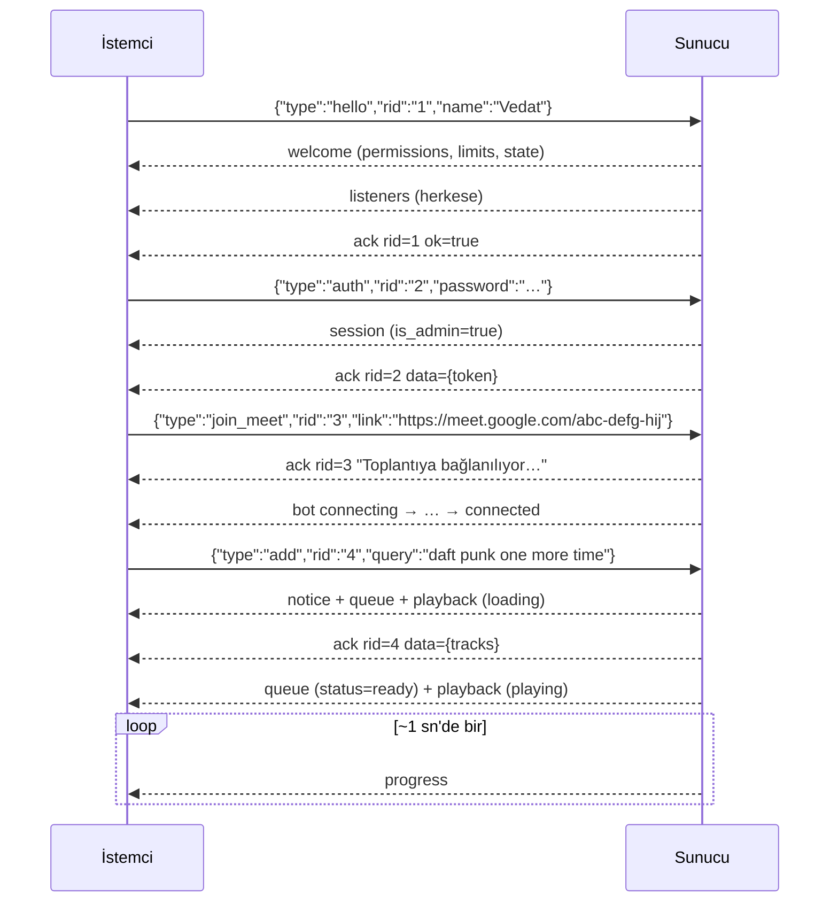

# 📡 MeetBot WebSocket Protokolü v2

Bu belge MeetBot **3.2** sunucusunun (`server.py` + `player.py`) web arayüzüyle konuştuğu protokolü anlatır. Kendi istemcinizi (bot, komut satırı aracı, Stream Deck eklentisi…) yazacaksanız ya da sunucuyu değiştirecekseniz buradan başlayın. Belge kodda gerçekten ne varsa onu anlatır. Bir çelişki bulursanız kod doğrudur ve bu belge güncellenmelidir.

> ⚠️ v2, 3.1'deki protokolle **uyumlu değildir** (mesaj adları ve el sıkışma değişti). Eşleme tablosu en sonda: [3.1'den geçiş](#31den-geçiş-v1--v2).

---

## 1. Bağlantı

| | |
|---|---|
| Adres | `ws://<sunucu>:<port>/ws`, ör. `ws://192.168.1.42:8000/ws` (TLS yok) |
| Çerçeveler | Yalnızca **metin** çerçeveleri; her çerçeve tek bir **JSON nesnesi** (UTF-8). İkili (binary) çerçevelere hata döner. |
| Host denetimi (DNS rebinding) | `Host` başlığı sunucunun gerçekten kullanılan bir adı olmalıdır: bir **IP adresi**, **tek parçalı bir ad** (`localhost`, bilgisayar adı), yalnızca yerel ağda çözülen bir uzantı (`.local`, `.lan`, `.home`, `.internal`, `.home.arpa`, `.localdomain`, `.localhost`) ya da `MEETBOT_TRUSTED_HOSTNAMES` listesindeki bir ad (`*` denetimi kapatır). Başka bir alan adıyla gelen WebSocket isteği kabul edilmeden kapatılır (kod `1008`, istemcide **HTTP 403**); HTTP istekleri **400** alır. Böylece saldırganın DNS'ini yönettiği bir sayfa, adını sunucunun IP'sine yeniden bağlasa bile (Origin ile Host ikisi de onun adı olur) bağlanamaz. `Host` başlığı hiç yoksa denetim yapılmaz. |
| Origin denetimi | İstekte `Origin` başlığı **varsa**, onun `host:port` kısmı isteğin `Host` başlığıyla aynı olmalıdır (varsayılan portlar `:80`/`:443` yok sayılır, büyük/küçük harf fark etmez). Değilse bağlantı kabul edilmeden kapatılır (sunucu içinde kod `1008`, istemci el sıkışmayı **HTTP 403** olarak görür). Tarayıcı dışı istemciler `Origin` göndermeyebilir; o zaman denetim yapılmaz. |
| Bağlantı sınırı | Aynı anda en fazla **100** WebSocket; **aynı adresten en fazla 10** (döngü adresi `127.0.0.1`/`::1` bu adres sınırına takılmaz: yerel makine ya da aynı makinedeki ters vekil). Fazlası kabul edilmeden kapatılır (kod `1013`, istemcide HTTP 403). |
| Oturum süresi | Bağlantıdan sonra **10 sn** içinde `hello` ile oturum açılmazsa sunucu bağlantıyı `1008` ile kapatır. |

Sunucu bir istemciyi kendisi yalnızca şu durumlarda kapatır:
- **1011:** İstemci bir yayını 2 sn içinde alamadı (yavaş ya da ölü bağlantı). Ardından kalan herkese `listeners` yayını gider.
- **1009:** Çerçeve 64 KB'ı aştı (uvicorn `ws_max_size`). 16 KB ile 64 KB arasındaki çerçeveler bağlantıyı **kapatmaz**, yalnızca hata döner (bkz. §5).
- **1008:** 10 sn içinde `hello` gelmedi (*Oturum açılmadı (hello)*), ya da istemci hız sınırına rağmen durmadan gönderiyor: kayan 10 sn'lik pencerede (reddedilenler dahil) **60'tan fazla çerçeve** (*Çok fazla mesaj*).

Bunların dışındaki hiçbir hata (geçersiz JSON, bilinmeyen tür, yetkisiz komut, hız sınırı, işleyicide beklenmeyen bir hata…) bağlantıyı kapatmaz.

## 2. El sıkışma: `hello` → `welcome`

Bağlantıdan sonraki **ilk komut `hello` olmalıdır**. Ondan önce gelen her komuta (`ping` dahil) `Önce 'hello' mesajı gönderilmeli` hatası döner, ama bağlantı açık kalır. Geçersiz bir `hello`'dan sonra (ör. isim boş) yeniden `hello` gönderilebilir. Oturum bağlantıdan sonra **10 sn** içinde açılmalıdır; açılmazsa bağlantı `1008` ile kapanır (§1).

```json
{"type": "hello", "rid": "r1", "name": "Vedat", "token": "Xy…(önceki auth'tan)"}
```

- `name`: Kontrol karakterleri ve çift yönlü metin (bidi) işaretleri silinir, art arda boşluklar teke indirilir. Sonuç **1–32 karakter** olmalıdır. Aynı ismi birden çok kişi kullanabilir; isimler doğrulanmaz.
- `token` *(isteğe bağlı)*: Daha önce `auth` ile alınmış yönetici anahtarı. Geçerliyse oturum yönetici olarak açılır. Geçersizse **hata vermez**; oturum misafir olarak açılır (`welcome.is_admin: false`). İstemci bu durumda sakladığı anahtarı silmelidir.
- Başarılı `hello`'ya yanıtlar **şu sırayla** gelir: `welcome` (yalnızca bu istemciye) → `listeners` (herkese) → `ack` (rid varsa; `message` ve `data` `null`).
- Oturum başladıktan sonra ikinci bir `hello` `Oturum zaten başlatıldı` hatası alır. İsim değiştirmek için yeni bir bağlantı açılır.

```json
{
  "type": "welcome",
  "client_id": "9f3a1c2e",
  "name": "Vedat",
  "is_admin": false,
  "permissions": ["ping", "state", "auth", "logout", "add", "remove",
                  "move", "play_now", "shuffle", "pause", "resume", "skip", "seek", "repeat", "volume"],
  "version": "3.2.0",
  "limits": {"max_queue": 100, "max_user_queue": 0, "max_duration": 0, "playlist_limit": 25, "guest_controls": true, "remote_view": "local"},
  "state": { "…": "tam anlık görüntü, bkz. §8" }
}
```

## 3. İstek kimliği (`rid`) ve `ack`

Her istemci mesajı isteğe bağlı bir `rid` taşıyabilir (**en fazla 64 karakterlik metin**; istemci üretir, sunucu olduğu gibi geri gönderir).

- `rid` **varsa**, sonuç ne olursa olsun (başarı ya da hata) o istemciye tam olarak bir `ack` döner:
  ```json
  {"type": "ack", "rid": "r7", "ok": true,  "message": "🔀 Kuyruk karıştırıldı", "data": null}
  {"type": "ack", "rid": "r8", "ok": false, "message": "Bu işlem için yönetici yetkisi gerekiyor", "data": null}
  ```
  `message` kullanıcıya gösterilebilecek kısa bir Türkçe metindir (ya da `null`). `data` yalnızca `auth` (`{"token": …}`) ve `add` (`{"tracks": […]}`) için doludur.
- `rid` **yoksa**, başarılı komutlar sessizce işlenir. Hatalar yalnızca o istemciye şöyle gider:
  ```json
  {"type": "error", "message": "Şu an çalan bir şarkı yok"}
  ```
- `rid` geçersizse (metin değil ya da 64 karakterden uzun) mesaj işlenmez ve `error` döner.
- Mesaj JSON olarak hiç ayrıştırılamadıysa (geçersiz JSON, çok büyük ya da ikili çerçeve) `rid` okunamaz. Bu durumda yanıt her zaman `error` olur.

## 4. Sıralama ve eşzamanlılık

- Her bağlantının komutları tek bir işçide **geliş sırasıyla** yürütülür. Yetki, komutun **yürütüldüğü andaki** oturuma göre denetlenir; yani art arda gönderilen `auth` + `clear` çalışır.
- `ping`, oturum başladıktan sonra sıraya girmez ve okuma döngüsünde hemen yanıtlanır. Uzun süren bir komut (ör. `leave_meet`) kalp atışını geciktirmez. `ping` hız sınırına da takılmaz: her zaman `pong` alır (bkz. §5).
- `add` arka planda çözülür (bağlantı başına aynı anda en fazla 3). Bu yüzden `ack`'i, kendisinden sonra gönderilen komutların `ack`'lerinden **sonra** gelebilir.
- Bir komutun yol açtığı yayınlar (`queue`, `playback`, `volume`…) genellikle o komutun `ack`'inden **önce** gönderilir. Bunun istisnaları:
  - `join_meet`: `ack` hemen döner; `bot` mesajları katılım ilerledikçe sonradan gelir.
  - `leave_meet`: `bot` mesajı `ack`'ten önce gelir.
  
  Sağlam bir istemci her mesajı bağımsız olarak işlemeli ve `ack` ile yayınların sırasına güvenmemelidir.
- Bağlantı kopmadan hemen önce gönderilen komutlar (ör. `skip`) yine de sırayla uygulanır.

## 5. Sınırlar

| Sınır | Değer | Aşılınca |
|---|---|---|
| Çerçeve boyutu | 16 KB (UTF-8 bayt) | `error`: *Mesaj çok büyük (en fazla 16 KB)*. 64 KB'ın üstünde bağlantı `1009` ile kapanır. |
| Hız | Kayan 10 sn'lik pencerede **30 çerçeve**. Her çerçeve ayrıştırılmadan önce sayılır: `hello`, `ping`, çok büyük, ikili ve geçersiz JSON çerçeveleri de. Sınıra takılıp reddedilenler bütçeden düşmez. | `error`/`ack(ok:false)`: *Çok hızlı mesaj gönderiyorsun, biraz yavaşla*. Bağlantı kapanmaz. İstisna: oturum açıkken `ping` sınıra takılmaz, her zaman `pong` alır (kalp atışı kopmasın). |
| Mesaj seli | Kayan 10 sn'lik pencerede (reddedilenler dahil) **60'tan fazla** çerçeve | Bağlantı `1008` ile kapanır (*Çok fazla mesaj*). |
| Bekleyen komut | Bağlantı başına 20 | *Sunucu meşgul, önceki işlemlerin bitmesini bekle* |
| Eşzamanlı `add` | Bağlantı başına 3 | *Önceki eklemelerin bitmesini bekle* |
| Hatalı şifre | **Adres başına** art arda 5 hatalı deneme → o adres **60 sn** kilitli; aynı adres yeniden kilitlendikçe süre ikiye katlanır (en fazla 1 saat). Kilit yeniden bağlanınca ya da başka bir bağlantıdan denenince sıfırlanmaz; başarılı giriş o adresin geçmişini siler. Ayrıca tüm adreslerden 60 sn içinde 30 hatalı deneme olursa pencere boşalana kadar kimse şifre deneyemez. | *Çok fazla hatalı deneme, N sn sonra tekrar dene* (kilitliyken doğru şifre de reddedilir) |
| `name` | 1–32 karakter (temizlendikten sonra) | *İsim 1–32 karakter olmalı* |
| `query` | 1–500 karakter | *'query' 1–500 karakterlik bir metin olmalı* |
| `password` | ≤ 256 karakter | *Şifre yanlış* |
| `link` | ≤ 2048 karakter | *'link' 1–2048 karakterlik bir metin olmalı* |
| Bağlantı | Toplam 100, adres başına 10 (döngü adresi hariç) | El sıkışma reddi (`1013`, HTTP 403) |
| Oturum açma süresi | 10 sn (`hello`) | Bağlantı `1008` ile kapanır |
| Yayın gönderimi | İstemci başına 2 sn | İstemci `1011` ile düşürülür |

Kuyruk sınırları (`MEETBOT_MAX_QUEUE`, `MEETBOT_MAX_USER_QUEUE`, `MEETBOT_MAX_DURATION`, `MEETBOT_PLAYLIST_LIMIT`) `welcome.limits` içinde istemciye bildirilir.

## 6. İstemci → Sunucu mesajları

**Yetki sütunu:** *herkes* = her oturum · *kontrol* = yönetici **ya da** `MEETBOT_GUEST_CONTROLS=true` iken misafir · *yönetici* = yalnızca `auth` yapmış oturum.

| `type` | Alanlar | Yetki | Başarıda | Notlar |
|---|---|---|---|---|
| `hello` | `name`, `token`? | — (ilk mesaj) | `welcome`, `listeners`, `ack` | §2 |
| `ping` | – | herkes | `pong` (+`ack`) | Oturumdan sonra sıraya girmeden yanıtlanır. |
| `state` | – | herkes | `state` (+`ack`) | Tam anlık görüntüyü yeniden ister (§8). |
| `auth` | `password` | herkes | `session`, sonra `ack` → `message: "Yönetici girişi başarılı"`, `data: {"token": "…"}` | Şifre `hmac.compare_digest` ile karşılaştırılır. Anahtar `secrets.token_urlsafe(24)` ile üretilir ve yalnızca bellekte tutulur (sunucu yeniden başlayınca ya da `logout` olunca geçersizleşir). |
| `logout` | – | herkes | `session`, `ack` → *Çıkış yapıldı* | Anahtar silinir. **Aynı anahtarla** açılmış diğer bağlantılar da yetkisini kaybeder ve onlara da `session` gider. |
| `add` | `query` | herkes | `notice` + `queue` (+`playback`) yayınları, sonra `ack` → *🎵 <başlık \| N şarkı> kuyruğa eklendi*, `data: {"tracks": [Track…]}` | `query`: YouTube video/liste linki ya da serbest metin (ilk YouTube arama sonucu). Arka planda çözülür (§4). Bot toplantıda ve oynatıcı boştaysa çalma başlar. |
| `remove` | `id` (tam sayı) | herkes* | `queue`, `ack` → *<başlık> kuyruktan çıkarıldı* | *Misafir, `GUEST_CONTROLS=false` iken yalnızca kendi eklediği (`added_by == name`) parçayı kaldırabilir. |
| `move` | `id`, `index` (tam sayı) | kontrol | `queue` | `index`, parça listeden çıkarıldıktan sonraki hedef konumdur ve `[0, len-1]` aralığına sıkıştırılır. |
| `play_now` | `id` | kontrol | `queue`, `playback` (+`history`) | Bot toplantıda olmalıdır. Parça başa alınır, çalan parça geçilir. |
| `shuffle` | – | kontrol | `queue`, `ack` → *🔀 Kuyruk karıştırıldı* | |
| `clear` | – | yönetici | `queue`, `ack` → *🧹 Kuyruk temizlendi* | Çalan parça etkilenmez. |
| `pause` | – | kontrol | `playback` | Zaten duraklatılmışsa bir şey yapmaz. |
| `resume` | – | kontrol | `playback` | Çalıyor ya da yükleniyorsa bir şey yapmaz. Bot toplantıda değilse → hata. Boşta ve kuyruk doluysa sıradaki parçayı başlatır. |
| `skip` | – | kontrol | `queue`, `playback` (+`history`) | `repeat: "one"` iken de sıradakine geçer. `repeat: "all"` iken çalan parça kuyruğun sonuna **yeni bir `id`** ile eklenir. |
| `stop` | – | yönetici | `queue`, `playback` (+`history`) | Çalan parçayı bitirir ve oynatıcı `idle` olur; kuyruk kalır. Çalan bir şey yoksa bir şey yapmaz. |
| `seek` | `position` (sayı, sn, ≥ 0) | kontrol | `progress` | Süre biliniyorsa `[0, duration]` aralığına sıkıştırılır. Parça yüklenirken ya da çalan bir şey yokken → hata. |
| `repeat` | `mode`: `"off"` \| `"one"` \| `"all"` | kontrol | `playback` | |
| `volume` | `target`: `"music"` \| `"mic"`, `value`: 0–100 tam sayı | kontrol | `volume` | Bot toplantıda değilse değer saklanır ve katılınca uygulanır. |
| `mic` | `muted` (bool) | yönetici | `mic` | Meet'teki mikrofon düğmesine basar. Yayındaki `muted`, Meet'ten **okunan** gerçek durumdur. |
| `join_meet` | `link` | yönetici | `ack` → *Toplantıya bağlanılıyor…*, ardından `bot` yayınları | `link` içinde `https://meet.google.com/<kod>` geçmelidir. `<kod>` ya `abc-defg-hij` biçiminde (küçük harfe çevrilir) ya da `lookup/<kimlik>` olmalıdır. Kodun arkasından gelen her şey atılır. Bot zaten **aynı** toplantıdaysa ya da ona bağlanıyorsa `ack` → *Bot zaten bu toplantıda* döner ve yeniden katılmaz. Başka bir toplantıdaysa önce oradan ayrılır. |
| `leave_meet` | – | yönetici | `bot`, sonra `ack` → *Bot toplantıdan ayrıldı* ya da (bağlanırken) *Katılma iptal edildi* | Bot `disconnected` iken → *Bot zaten bir toplantıda değil*. Gerçek botta ayrılmak birkaç saniye sürebilir. |

Bilinmeyen bir `type` → *Bilinmeyen mesaj türü: …*. Eksik `type` → *Mesaj türü (type) eksik*.

### Alan doğrulama hataları
- *'id' bir tam sayı olmalı* (`true`/`false` tam sayı sayılmaz)
- *'position' bir sayı olmalı* (NaN/∞ kabul edilmez), *'position' negatif olamaz*
- *'<alan>' 1–N karakterlik bir metin olmalı*
- *'muted' true/false olmalı*
- *Geçersiz tekrar modu*, *Geçersiz ses hedefi*, *Ses seviyesi 0–100 arasında bir tam sayı olmalı*

### Yetki hataları
- Yönetici komutu → *Bu işlem için yönetici yetkisi gerekiyor*
- `GUEST_CONTROLS=false` iken kontrol komutu → *Bu işlem için yetkin yok (misafir kontrolleri kapalı)*

`welcome.permissions` ve `session.permissions`, o oturumun gönderebileceği türlerin tam listesidir (`hello` bu listede yer almaz):

```text
herkes     : ping, state, auth, logout, add, remove
+ kontrol  : move, play_now, shuffle, pause, resume, skip, seek, repeat, volume
+ yönetici : clear, stop, mic, join_meet, leave_meet
```

### Oynatıcıdan sık gelen hatalar
*Şarkı kuyrukta bulunamadı* · *Sadece kendi eklediğin şarkıları kaldırabilirsin* · *Bot toplantıda değil* · *Kuyruk boş* · *Şu an çalan bir şarkı yok* · *Şarkı henüz yükleniyor* · *Kuyruk dolu (en fazla 100 şarkı)* · *Kuyrukta en fazla N şarkın olabilir* · *Şarkı çok uzun (en fazla 20:00)* · *Canlı yayınlar eklenemez* · *Sonuç bulunamadı* · *Sadece YouTube bağlantıları destekleniyor* · *Geçersiz Meet bağlantısı (örnek: https://meet.google.com/abc-defg-hij)* · *Beklenmeyen bir hata oluştu*.

Hata metinleri hiçbir zaman dosya yolu ya da yt-dlp'nin ham çıktısını içermez; ayrıntılar yalnızca sunucu günlüğüne yazılır.

### Bot ekranı (yönetici)

Yalnızca yönetici ve `MEETBOT_REMOTE_VIEW` izin veriyorsa (`local`: yalnızca döngü adresinden, yani sunucunun kendisinden ya da SSH tüneliyle; `on`: her yerden; `off`: hiç) kullanılabilir. İzin yoksa bu türler `permissions` listesinde yer almaz.

| type | alanlar | açıklama |
|---|---|---|
| `view_start` | `target`: `meet` \| `login` | Bot ekranını açar / sekme değiştirir. Tarayıcı kapalıysa (durum bildirmeden) açılır. `login` ayrı, temiz bir Google giriş sekmesidir; `meet`e dönünce kapanır. **Google hesabı bağlıyken `login` reddedilir.** Bağlantı `view_frame` almaya başlar. |
| `view_stop` | – | İzlemeyi bırakır (bağlantı kopunca / çıkış yapınca da kendiliğinden). |
| `view_input` | `action`: `click` (`x`, `y`: görüntüye göre 0–1), `type` (`text`: 1–500 karakter), `key` (`key`: `Enter`, `Tab`, `Shift+Tab`, `Backspace`, `Delete`, `Escape`, `Space`, ok tuşları, `Home`, `End`, `PageUp`, `PageDown`, `Control+a`), `scroll` (`dy`: piksel), `back`, `reload` | **Yalnızca Google girişi sekmesine ve yalnızca oturum açılmamışken** gider (Meet sekmesi salt izlenir). Önce `view_start` gerekir. `text` asla günlüğe yazılmaz. Oturum açıldığı an giriş sekmesi kapanır ve girdi reddedilir. |
| `google_logout` | – | Botun Google oturumunu kapatır (Google/YouTube çerezleri silinir); başka hesapla girmek için. Bot toplantıdayken reddedilir. |

## 7. Sunucu → İstemci mesajları

Tüm yayınlar (`queue`, `playback`, `progress`, `volume`, `mic`, `bot`, `history`, `listeners`, `notice`) oturumu başlamış **herkese** gider. `welcome`, `session`, `state`, `ack`, `error` ve `pong` yalnızca ilgili istemciye gönderilir.

| `type` | Alanlar | Ne zaman? |
|---|---|---|
| `welcome` | `client_id`, `name`, `is_admin`, `permissions`, `version`, `limits`, `state` | Başarılı `hello` sonrası (§2) |
| `session` | `is_admin`, `permissions` | `auth` ve `logout` sonrası; aynı anahtarı paylaşan diğer bağlantılara da gider. |
| `state` | anlık görüntünün alanları **üst düzeyde** (§8) | `state` isteğine yanıt olarak |
| `queue` | `queue: [Track]` | Kuyruk ya da bir parçanın indirme durumu değişince |
| `playback` | `current: Track \| null`, `state`, `position`, `duration`, `repeat` | Çalan parça, durum ya da tekrar modu değişince |
| `progress` | `position`, `duration`, `state` | Yüklü bir parça varken (çalarken ya da duraklatılmışken) en fazla ~1/sn; ayrıca her `seek` sonrasında. |
| `volume` | `music`, `mic` | Ses seviyesi değişince |
| `mic` | `muted` | Botun mikrofon durumu değişince |
| `bot` | `status`, `meet_link`, `detail` | Bot durumu ya da katılım aşaması değişince |
| `history` | `history: [Track]` (en yeni başta) | Bir parça geçmişe geçince |
| `listeners` | `listeners: [isim…]`, `count` | Biri bağlanınca ya da ayrılınca |
| `notice` | `level`: `info` \| `success` \| `warning` \| `error`, `message` | İnsana yönelik olaylar (şarkı eklendi, atlandı, çalınamadı…) |
| `ack` | `rid`, `ok`, `message`, `data` | §3 |
| `error` | `message` | `rid`'siz bir mesaj başarısız olunca |
| `pong` | – | `ping` yanıtı |

Örnekler:

```json
{"type": "playback", "current": {"id": 3, "video_id": "jNQXAC9IVRw", "title": "Me at the zoo", "…": "…"},
 "state": "playing", "position": 0.0, "duration": 19.0, "repeat": "off"}

{"type": "progress", "position": 12.4, "duration": 19.0, "state": "playing"}

{"type": "volume", "music": 65, "mic": 80}

{"type": "mic", "muted": false}

{"type": "bot", "status": "connecting", "meet_link": "https://meet.google.com/abc-defg-hij",
 "detail": "Katılma isteği gönderildi, onay bekleniyor…"}

{"type": "listeners", "listeners": ["Ayşe", "Vedat"], "count": 2}

{"type": "notice", "level": "success", "message": "🎵 Vedat: Me at the zoo kuyruğa eklendi"}

{"type": "notice", "level": "warning",
 "message": "🎵 Vedat: 23 şarkı kuyruğa eklendi (2 şarkı atlandı: 1 çok uzun, 1 canlı yayın)"}

{"type": "notice", "level": "warning", "message": "⚠️ Bir Şarkı indirilemedi, atlandı"}
```

- `position` ve `duration` saniye cinsindendir ve 0,1'e yuvarlanır. `duration` bilinmiyorsa `0` olur.
- `listeners`, isimleri tekilleştirip büyük/küçük harf duyarsız sıralar. `count` benzersiz isim sayısıdır.

### Bot ekranı mesajları (yalnızca izleyen yöneticiye)

- `view_frame` `{target, interactive, image, width, height, url, title, signed_in}` — `interactive`: girdi kabul ediliyor mu (yalnızca giriş sekmesi); `image` bir `data:image/jpeg;base64,…` (sahte botta `png`) ekran görüntüsüdür; `width`/`height` sayfanın CSS piksel boyutu; `signed_in` botun profilinde Google oturumu açık mı (`true`/`false`/`null`). İzleyici varken ~0,5 sn'de bir alınır; **değişmeyen kare tekrar gönderilmez**.
- `view_error` `{message}` — ekran görüntüsü alınamadı (art arda hatalarda yalnızca ilki).
- `view_closed` `{message}` — art arda 5 hatadan sonra izleme bitti; yeniden `view_start` gerekir.

### Oynatıcı durumları (`playback.state`)

| Durum | Anlamı |
|---|---|
| `idle` | Çalan parça yok (`current: null`). |
| `loading` | `current` seçildi; dosya iniyor ya da Meet sekmesine yükleniyor. |
| `playing` | Bot sesi gerçekten çalıyor. Bu durum yalnızca botun `play` çağrısı **başarılı olduktan sonra** ayarlanır. |
| `paused` | Duraklatıldı, **ya da** bot toplantıdan düştü. Bot toplantıdan düştüğü için duraklayan parça, bot yeniden `connected` olunca kaldığı konumdan tekrar yüklenir ve çalar. Kullanıcının `pause` ile **bilerek** duraklattığı parça ise (yeniden bağlanma ya da başka toplantıya geçişten sonra da) duraklatılmış kalır; `resume` gelince kaldığı yerden yüklenir. |

**Tekrar (`repeat`):** Parça bitince davranış moda göre değişir:
- `off`: Parça `history`'ye geçer, sıradaki başlar.
- `one`: Aynı parça baştan çalar.
- `all`: Parça yeni bir `id` ile kuyruğun sonuna eklenir.

İndirilemeyen ya da çalınamayan parçalar `status: "error"` olur. Sırası gelince bir `notice` ile atlanırlar ve geçmişe yazılmazlar.

### Bot durumları (`bot.status`)

- `disconnected`: Toplantıda değil. Çalma komutları reddedilir (*Bot toplantıda değil*); şarkı eklemek serbesttir.
- `connecting`: Katılım sürüyor. `detail` aşamayı söyler: *Toplantıya bağlanılıyor…*, *Tarayıcı hazırlanıyor…*, *Meet açılıyor…*, *Katılma isteği gönderildi, onay bekleniyor…*, *Toplantıya giriliyor…*, *Tekrar deneniyor (2/3)…*. Toplantı sahibi botu bekleme odasına geri gönderirse durum `connected` → `connecting` olur (*Bekleme odasına alındı, toplantı sahibinin geri alması bekleniyor…*).
- `connected`: Toplantıda (`detail`: *Toplantıya katıldı*, bekleme odasından dönünce *Toplantıya yeniden kabul edildi*). Kuyruk varsa çalma kendiliğinden başlar.

`disconnected` geçişinde `detail` nedeni söyler. Örnekler:
- *Toplantıdan ayrıldı*
- *Katılma iptal edildi*
- *Toplantı sahibi katılma isteğini reddetti*
- *Katılma isteğine kimse yanıt vermedi*
- *Toplantıya 180 sn içinde kabul edilmedi*
- *Bu toplantıya katılınamıyor (Meet oturum açmamış katılımcıları kabul etmiyor olabilir: botun Chrome profilinde bir Google hesabıyla oturum açın)*
- *Toplantı bulunamadı (bağlantıyı kontrol edin)*
- *Toplantı henüz başlamamış (bot toplantı başlatamaz)*
- *Toplantıdan çıkarıldı*
- *Toplantı sona erdi*
- *Bekleme odasından ayrıldı*
- *Bekleme odasından N sn içinde geri alınmadı*
- *Meet 'Hâlâ orada mısınız?' sorusu yanıtlanmadığı için botu çıkardı*
- *Meet sekmesi çöktü*
- *Meet sekmesi veya tarayıcı kapatıldı*
- *Meet katılma ekranı açılmadı (katılma düğmesi bulunamadı)*
- *Chrome veya Edge bulunamadı (MEETBOT_CHROME_PATH ayarını kontrol edin)*

`--fake-bot` modunda bağlanma ve katılma metinleri *(sahte bot)* ekiyle gelir (ör. *Toplantıya katıldı (sahte bot)*).

## 8. Veri şekilleri

### Track

```json
{
  "id": 7,
  "video_id": "jNQXAC9IVRw",
  "title": "Me at the zoo",
  "duration": 19,
  "duration_str": "0:19",
  "url": "https://www.youtube.com/watch?v=jNQXAC9IVRw",
  "thumbnail": "https://i.ytimg.com/vi/jNQXAC9IVRw/mqdefault.jpg",
  "added_by": "Vedat",
  "added_at": "2026-09-23T10:15:00Z",
  "status": "ready"
}
```

| Alan | Tür | Açıklama |
|---|---|---|
| `id` | int | Sunucunun verdiği kimlik; süreç boyunca benzersizdir. `repeat: "all"` ile yeniden kuyruğa giren parça yeni bir `id` alır. |
| `video_id` | str | YouTube video kimliği (`^[A-Za-z0-9_-]{6,20}$`) |
| `title` | str | En fazla 300 karakter. **Güvenilmeyen metindir**: istemci HTML olarak değil, düz metin olarak göstermelidir. |
| `duration` | int \| null | Saniye cinsinden süre; bilinmiyorsa `null` |
| `duration_str` | str | `"m:ss"` ya da `"h:mm:ss"`; bilinmiyorsa `"?"` |
| `url` | str | Kanonik `https://www.youtube.com/watch?v=<id>` |
| `thumbnail` | str | `https://i.ytimg.com/vi/<id>/mqdefault.jpg` |
| `added_by` | str | Ekleyen oturumun adı (sunucu belirler, istemci gönderemez) |
| `added_at` | str | ISO-8601 UTC, ör. `"2026-09-23T10:15:00Z"` |
| `status` | str | `pending` → `downloading` → `ready`, ya da `error` |

Dosya yolu ve iç hata metni hiçbir zaman gönderilmez.

### Anlık görüntü (snapshot)

`welcome.state` içinde iç içe gelir. `state` yanıtında ise aynı alanlar mesajın **üst düzeyinde** bulunur (`{"type": "state", "queue": [...], ...}`).

```json
{
  "queue": [],
  "current": null,
  "playback": {"state": "idle", "position": 0, "duration": 0, "repeat": "off"},
  "volume": {"music": 80, "mic": 80},
  "mic_muted": false,
  "bot": {"status": "disconnected", "meet_link": null, "detail": null},
  "history": [],
  "listeners": ["Vedat"]
}
```

## 9. Örnek oturum



## 10. HTTP uç noktaları

| Yol | Açıklama |
|---|---|
| `GET /` | `static/index.html` (`Cache-Control: no-cache`) |
| `GET /static/*` | Arayüz dosyaları (`no-cache`) |
| `GET /api/health` | `{"ok": true, "version": "3.2.0", "bot_status": "disconnected", "queue_length": 0, "listeners": 1}`. `listeners` burada benzersiz isim **sayısıdır**. |

İndirilen ses dosyaları HTTP üzerinden **sunulmaz** (`/downloads` yok). Bot dosyayı diskten okuyup Meet sekmesine kendisi yükler. CORS ara katmanı ve FastAPI'nin `/docs` sayfası da kapalıdır.

Tüm HTTP isteklerinde de `Host` başlığı denetlenir (§1): tanınmayan bir alan adıyla gelen istek **400** *Geçersiz Host başlığı* alır. Panele özel bir alan adıyla (ör. ters vekil üzerinden `meetbot.example.com`) erişiyorsanız bu adı `MEETBOT_TRUSTED_HOSTNAMES` ayarına (virgülle ayrılmış) ekleyin.

## 3.1'den geçiş (v1 → v2)

| 3.1 (v1) | 3.2 (v2) |
|---|---|
| El sıkışma yok | İlk mesaj `hello`, yanıtı `welcome` |
| İstemcide `password123` karşılaştırması | `auth` → sunucuda doğrulama, `session` + anahtar |
| `add_song` | `add` (`query`: link, liste ya da şarkı adı) |
| `remove_song` | `remove` (`id`) |
| `reorder_queue` (tüm liste) | `move` (`id`, `index`) |
| `loop` | `repeat` (`off` / `one` / `all`) |
| `set_volume` | `volume` (`target`, `value`) |
| `toggle_mic` | `mic` (`muted`) |
| `skip`, `stop`, `pause`, `resume`, `join_meet`, `leave_meet` | Aynı adlar; artık yetki denetimli ve `rid`/`ack` destekli |
| `state_sync` | `welcome.state` / `state` |
| `queue_update`, `playback_update`, `progress_update` | `queue`, `playback`, `progress` |
| `volume_update`, `mic_status`, `bot_status` | `volume`, `mic`, `bot` |
| `song_added` | `notice` + `add`'in `ack`'i |
| — | Yeni: `ping`/`pong`, `play_now`, `shuffle`, `clear`, `seek`, `logout`, `state`, `history`, `listeners` |

---

[← README'ye dön](../README.md)
